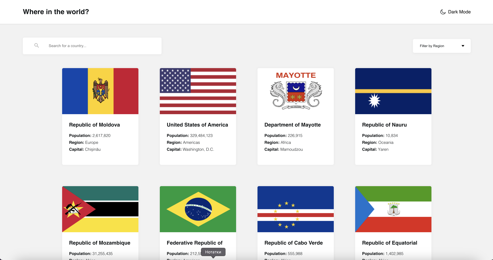

# Frontend Mentor - REST Countries API with color theme switcher solution

This is a solution to the [REST Countries API with color theme switcher challenge on Frontend Mentor](https://www.frontendmentor.io/challenges/rest-countries-api-with-color-theme-switcher-5cacc469fec04111f7b848ca). Frontend Mentor challenges help you improve your coding skills by building realistic projects. 
## Table of contents

- [Overview](#overview)
  - [The challenge](#the-challenge)
  - [Screenshot](#screenshot)
  - [Links](#links)
- [My process](#my-process)
  - [Built with](#built-with)
- [Author](#author)

## Overview

### The challenge

Users should be able to:

- See all countries from the API on the homepage
- Search for a country using an `input` field
- Filter countries by region
- Click on a country to see more detailed information on a separate page
- Click through to the border countries on the detail page
- Toggle the color scheme between light and dark mode

### Screenshot

### Links

- Solution URL: [Add solution URL here](https://github.com/AnnaofAmber/rest-countries-api)
- Live Site URL: [Add live site URL here](https://annaofamber.github.io/rest-countries-api/)

## My process

### Built with

- Semantic HTML5 markup
- SCSS custom properties
- Flexbox
- Mobile-first workflow
- [React](https://reactjs.org/) - JS library
- [Redux](https://redux.js.org/) - For state management
- [CSS Modules](https://github.com/css-modules/css-modules) - For styles
- [clsx](https://www.npmjs.com/package/clsx) - For using classes conditionally 
- [Notiflix](https://notiflix.github.io/) - For notifications
- [Axios](https://axios-http.com/uk/docs/intro) - For making HTTP requests
- [React-paginate](https://www.npmjs.com/package/react-paginate) - For pagination

## Author

- LinkedIN - [Anna Boichuk](www.linkedin.com/in/anna-boichuk-a6a050238)
- Frontend Mentor - [@AnnaofAmber](https://www.frontendmentor.io/profile/AnnaofAmber)
- GitHub - [@AnnaofAmber](https://github.com/AnnaofAmber)
